## Exercise on Linux

### 1. Users and Group Permissions

- A user is the owner of the file. By default, the person who created a file becomes its owner. Hence, a user is also sometimes called an owner.
- Group: A user- group can contain multiple users. All users belonging to a group will have the same Linux group permissions access to the file.
- Other: Any other user who has access to a file. This person has neither created the file, nor he belongs to a usergroup who could own the file.

#### Three Permissions in Linux

- Read: This permission give you the authority to open and read a file. Read permission on a directory gives you the ability to lists its content.
- Write: The write permission gives you the authority to modify the contents of a file. The write permission on a directory gives you the authority to add, remove and rename files stored in the directory.
- Execute: In Windows, an executable program usually has an extension “.exe” and which you can easily run. In Unix/Linux, you cannot run a program unless the execute permission is set.

 
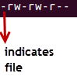
 
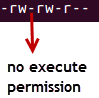
 
.png>)

Absolute(Numeric) Mode

| Number | Permission Type       | Symbol |
| ------ | --------------------- | ------ |
| 0      | No Permission         | -      |
| 1      | Execute               | -X     |
| 2      | Write                 | -W-    |
| 3      | Execute + Write       | -WX    |
| 4      | Read                  | r-     |
| 5      | Read + Execute        | r-x    |
| 6      | Read +Write           | rw-    |
| 7      | Read + Write +Execute | rwx    |

|

### 2. Create (3) groups and (15) users

#### Create (3) Groups

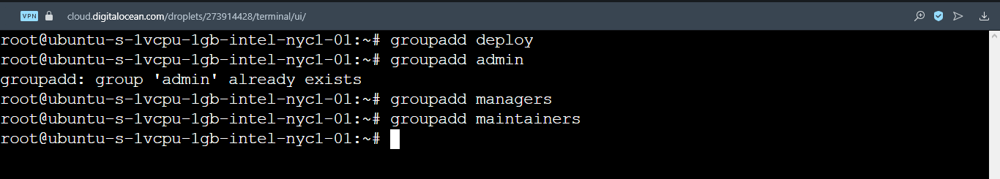

- List all groups
  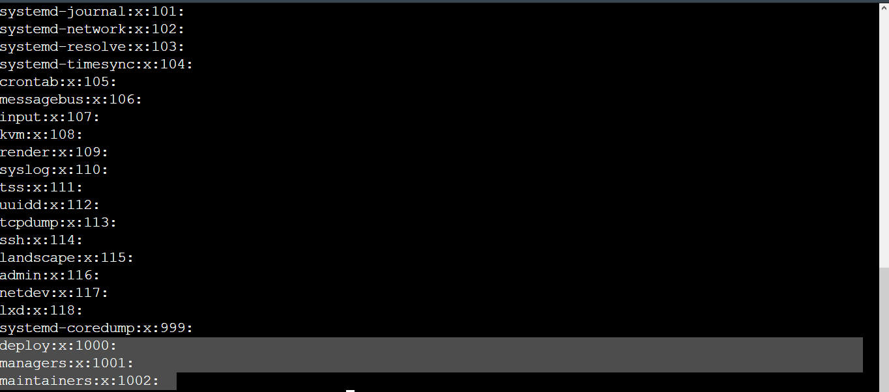

#### Create (15) Users

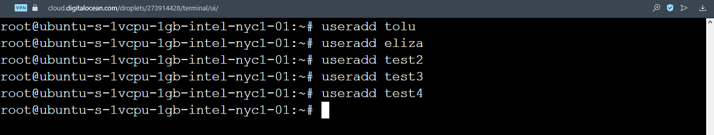

- List all users
  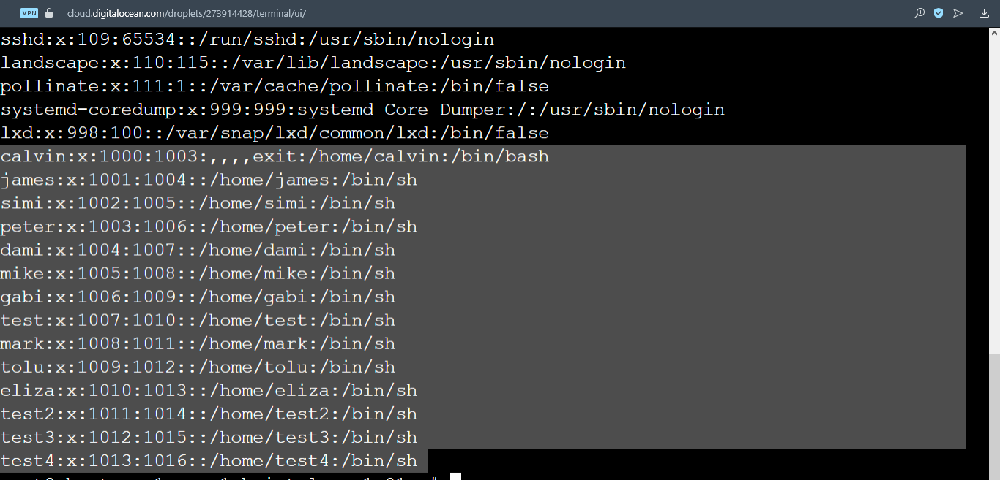

### 3. Assign the 15 users across the 3 groups

- List all users belonging to "deploy group"
  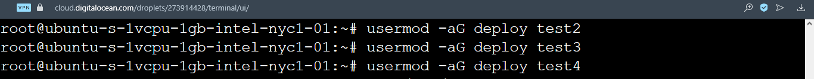
- List all users belonging to "managers group"
  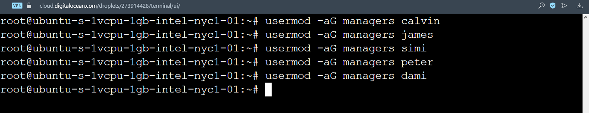
- List all users belonging to "deploy group"
  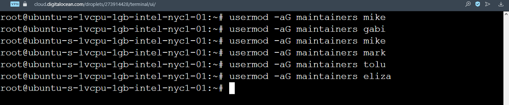
   
- List of groups
  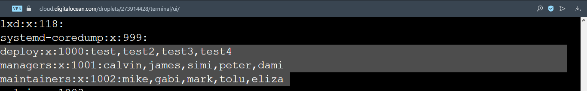

### 4. Demonstrate that user(s) in a group cannot access files/folders that belong to another group unless they are added to that group.

- I switch to user "calvin"
  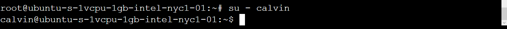
- I create a file
  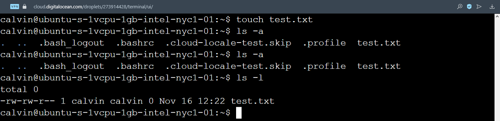
- I change the newly created file permission
  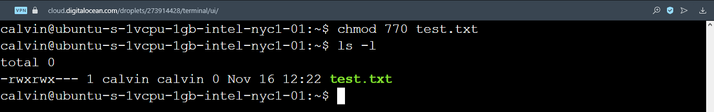
- Using "test user" from a different group
  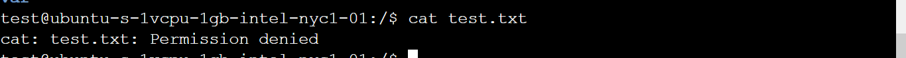
  - Add "test user" to deploy group access the file
    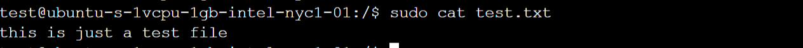
